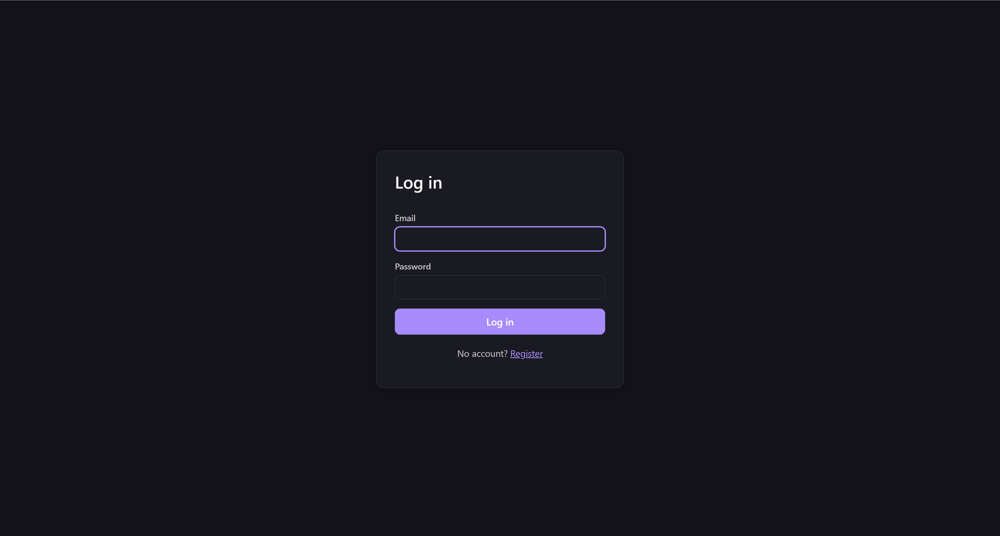
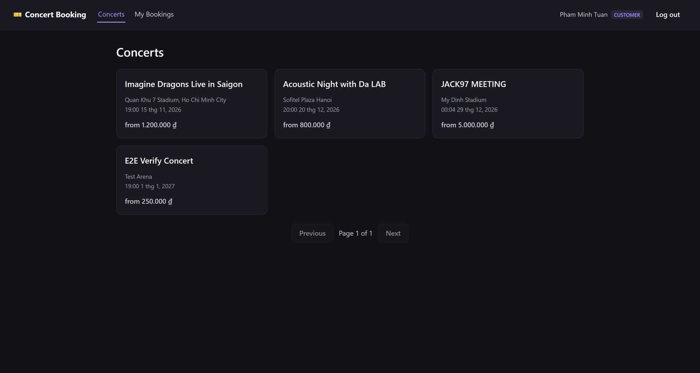
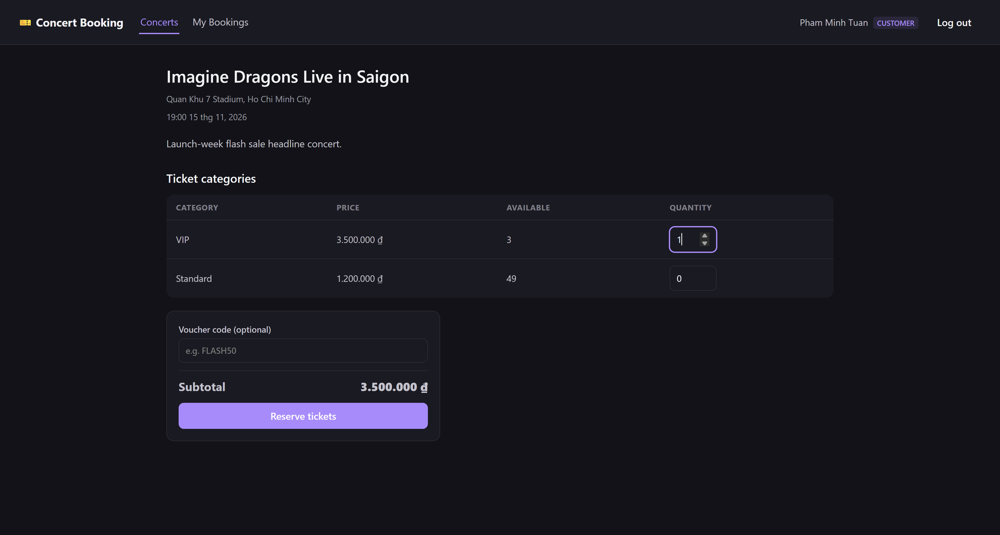
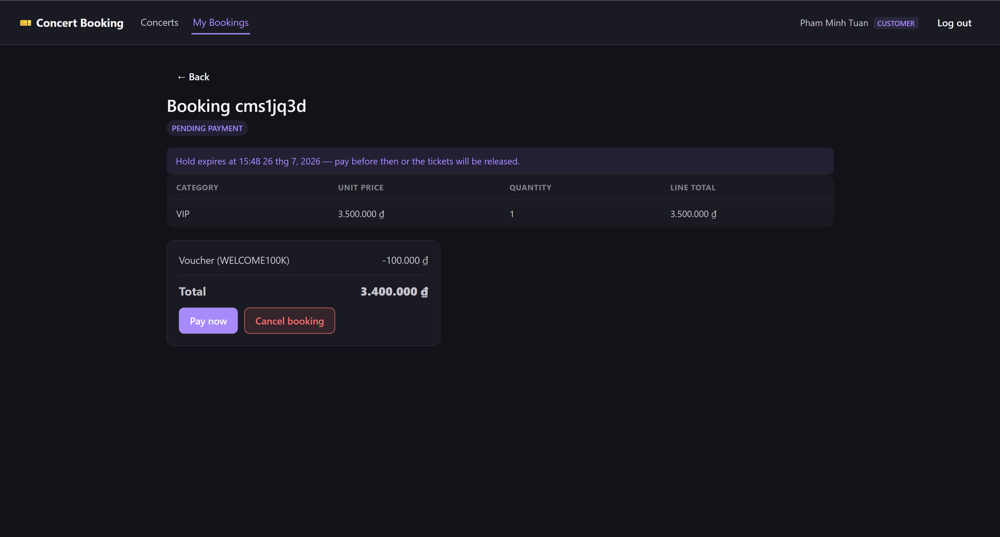
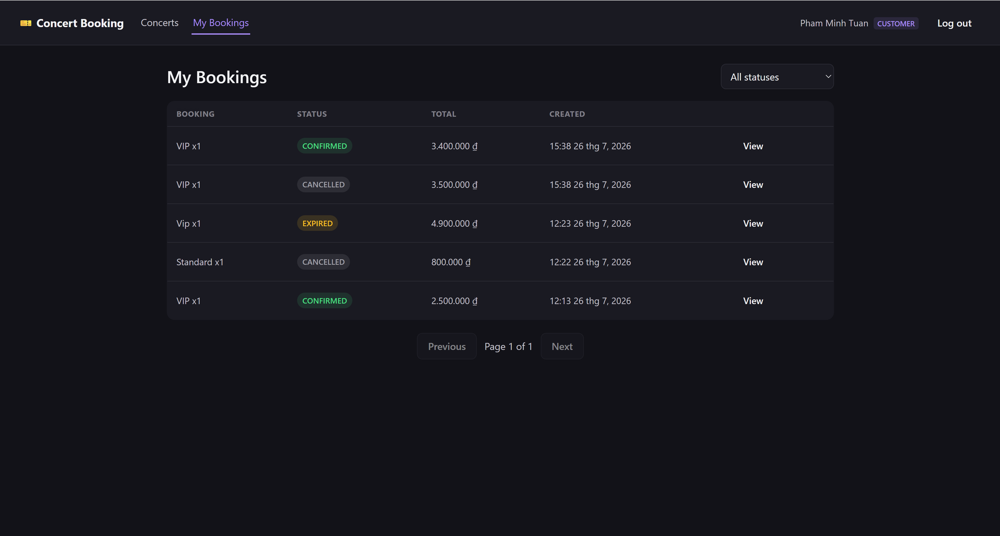
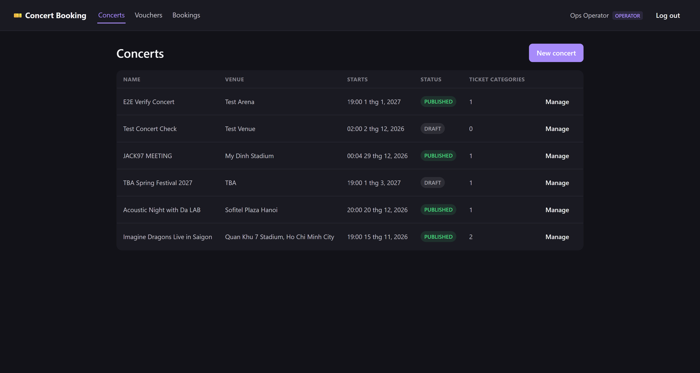
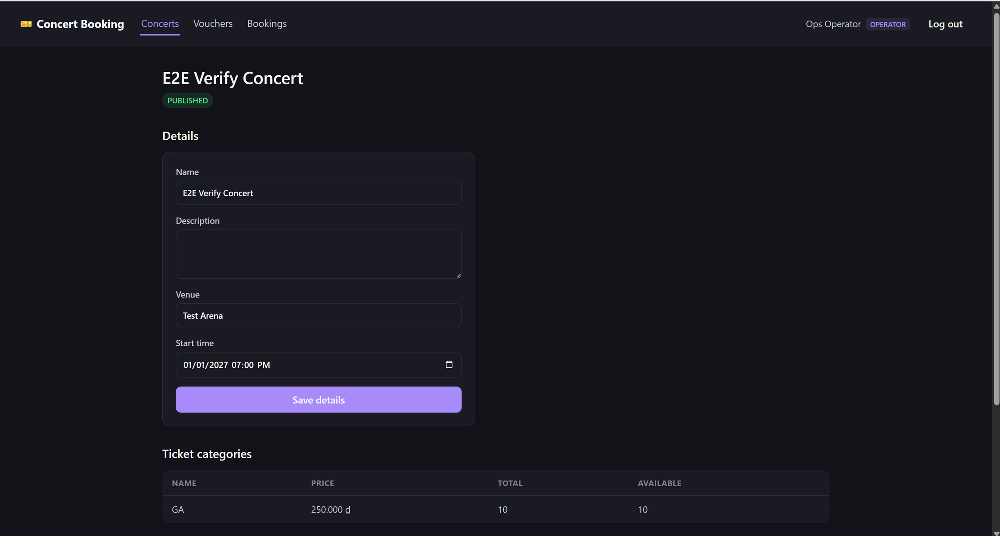
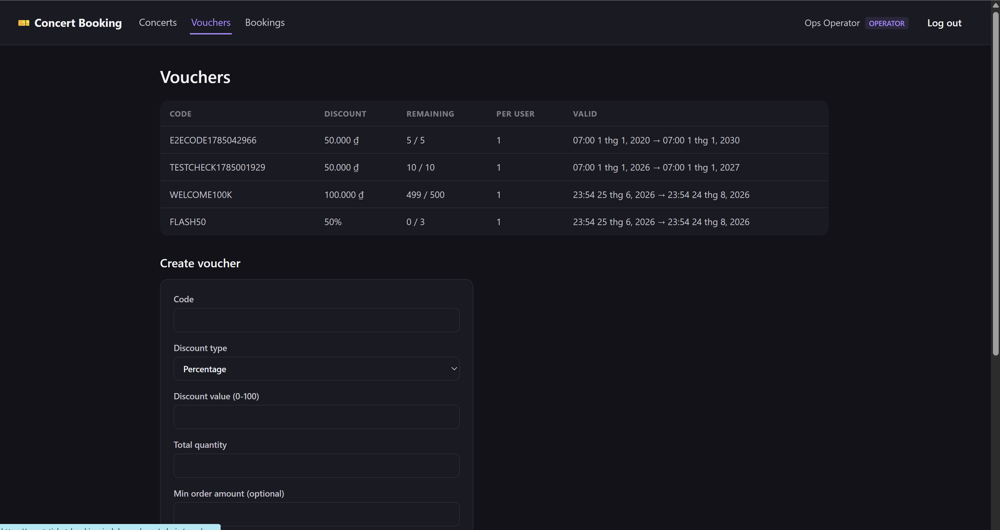
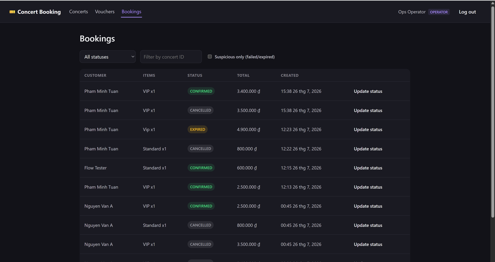
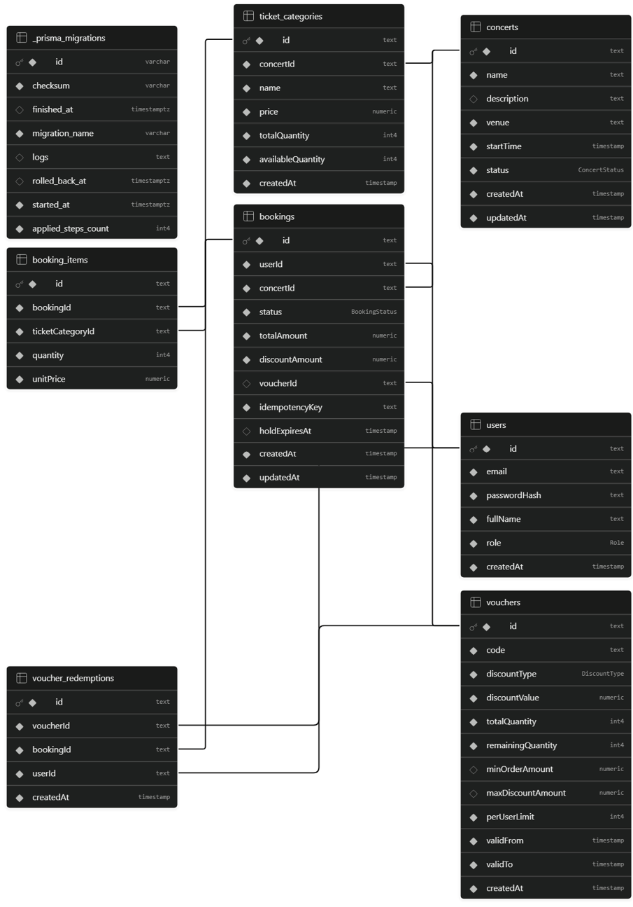

# Concert Ticket Booking Platform

Take-home assignment submission: a backend for a Concert Ticket Booking Platform covering
customer-facing booking flows and an internal Operation Dashboard, plus a `frontend/` React app
that consumes the API.

- **Stack**: NestJS + TypeScript, PostgreSQL (via Prisma), Redis
- **System design & DB design**: [`docs/architecture.md`](docs/architecture.md)
- **Assumptions & scope limitations**: [`docs/ASSUMPTIONS.md`](docs/ASSUMPTIONS.md)
- **Coding guideline / how to add an API / how to run tests**: [`docs/CONTRIBUTING.md`](docs/CONTRIBUTING.md)
- **API docs**: Swagger UI at `/api/docs` once running
- **Postman collection**: [`docs/postman_collection.json`](docs/postman_collection.json) + [`docs/postman_environment.json`](docs/postman_environment.json)

## Prerequisites

- Node.js 20+
- Docker Desktop (for local Postgres + Redis)

## Link Deployment: https://event-ticket-booking-indol.vercel.app

## Setup & run locally

```bash
# 1. Install dependencies
npm install

# 2. Copy env file (defaults already match docker-compose.yml)
cp .env.example .env

# 3. Start Postgres + Redis
docker compose up -d

# 4. Apply database schema
npx prisma migrate dev

# 5. Seed sample data (1 operator, 2 customers, 3 concerts, 2 vouchers)
npm run seed

# 6. Start the API in watch mode
npm run start:dev
```

The app listens on `http://localhost:3000`. Swagger UI: `http://localhost:3000/api/docs`.

## Frontend

`frontend/` is a separate React + Vite + TypeScript SPA covering both the customer booking flow
(browse concerts, reserve tickets, apply a voucher, pay/cancel, track bookings) and the operator
dashboard (manage concerts/ticket categories, publish, create vouchers, monitor & resolve
bookings). It talks to the API above through a dev-server proxy — it has no other backend of its
own.

```bash
cd frontend
npm install
npm run dev   # http://localhost:5173, proxies /api/* to http://localhost:3000
```

Run the backend (`npm run start:dev` from the repo root) first so the proxy has something to talk
to. Log in with one of the [seeded accounts](#seeded-accounts-password-for-all-password123) —
`OPERATOR` accounts land on the admin dashboard, `CUSTOMER` accounts land on the booking flow.

### Screenshots

**Auth**



**Customer flow**

| Browse concerts | Select tickets & apply voucher | Hold pending payment |
|---|---|---|
|  |  |  |

The booking hold shows a countdown (`holdExpiresAt`) — if payment isn't made before it expires, the
cron sweep in `BookingsService` releases the reserved tickets automatically.



**Operator dashboard**

| Manage concerts | Edit concert & ticket categories |
|---|---|
|  |  |

| Manage vouchers | Monitor & resolve bookings |
|---|---|
|  |  |

### Troubleshooting: Docker Desktop / WSL2 not starting

If `docker compose up -d` hangs or `docker` commands fail with a WSL-related error (Windows), the
WSL2 backend itself is stuck rather than Docker:

```powershell
wsl --shutdown   # then reopen Docker Desktop
```

If that doesn't resolve it, reboot Windows. As a last resort (no admin rights / WSL still broken),
Postgres and Redis can run natively instead of via Docker — the app only cares about
`DATABASE_URL`/`REDIS_URL` in `.env`, not how those services are hosted:

- Postgres: install with `winget install PostgreSQL.PostgreSQL.17`, or run any portable Postgres
  binaries (e.g. `initdb` + `pg_ctl start` against a local data directory) and point
  `DATABASE_URL` at it.
- Redis: install [Memurai](https://www.memurai.com/) (Redis-compatible, has a free dev edition),
  or run a portable `redis-server.exe` build, and point `REDIS_URL` at it.

### Troubleshooting: `npm run start:dev` exits after editing a file (Windows)

On Windows, `nest start --watch` recompiles on every file change and tries to `taskkill` the
previous `node` process before restarting it. That kill can intermittently fail with
`ERROR: The process with PID ... could not be terminated`, which makes the watch command itself
exit with code 1 — **even though a server process is usually still listening on the port** (verify
with `curl http://localhost:3000/health`). This is a watcher process-management quirk, not a
compile/runtime error. Just re-run `npm run start:dev` to get live-reload back; if the port is
still held, find and stop the stray process first (`netstat -ano | findstr :3000`, then
`taskkill /PID <pid> /F`).

### Seeded accounts (password for all: `Password123!`)

| Role | Email |
|---|---|
| Operator | `operator@ticketing.local` |
| Customer | `customer1@ticketing.local` |
| Customer | `customer2@ticketing.local` |

### Trying it out

1. Import `docs/postman_collection.json` and `docs/postman_environment.json` into Postman.
2. Select the "Ticketing - Local" environment.
3. Run the collection's folders top-to-bottom: **Auth → Admin - Concerts → Admin - Vouchers →
   Concerts (Public) → Bookings (Public) → Admin - Bookings**. Requests chain automatically via
   collection variables (tokens, concert/ticket-category/booking IDs).

Alternatively, browse and call everything directly from Swagger UI at `/api/docs` — the access
token is an `httpOnly` cookie set automatically by `POST /auth/login` or `/auth/register`, so once
you've called one of those from the "Try it out" panel, subsequent requests on the same page are
already authenticated (no `Authorize` step needed).

## Running tests

```bash
npm run test        # unit tests (focused on BookingsService concurrency logic)
npm run test:watch
npm run test:cov
```

## Database schema

Generated from the current production schema (see [`docs/architecture.md`](docs/architecture.md#2-data-model)
for the design rationale behind the constraints and indexes).



### Table `users`

| Name | Type | Constraints |
|------|------|-------------|
| `id` | `text` | Primary |
| `email` | `text` |  |
| `passwordHash` | `text` |  |
| `fullName` | `text` |  |
| `role` | `Role` |  |
| `createdAt` | `timestamp` |  |

### Table `concerts`

| Name | Type | Constraints |
|------|------|-------------|
| `id` | `text` | Primary |
| `name` | `text` |  |
| `description` | `text` | Nullable |
| `venue` | `text` |  |
| `startTime` | `timestamp` |  |
| `status` | `ConcertStatus` |  |
| `createdAt` | `timestamp` |  |
| `updatedAt` | `timestamp` |  |

### Table `ticket_categories`

| Name | Type | Constraints |
|------|------|-------------|
| `id` | `text` | Primary |
| `concertId` | `text` |  |
| `name` | `text` |  |
| `price` | `numeric` |  |
| `totalQuantity` | `int4` |  |
| `availableQuantity` | `int4` |  |
| `createdAt` | `timestamp` |  |

### Table `vouchers`

| Name | Type | Constraints |
|------|------|-------------|
| `id` | `text` | Primary |
| `code` | `text` |  |
| `discountType` | `DiscountType` |  |
| `discountValue` | `numeric` |  |
| `totalQuantity` | `int4` |  |
| `remainingQuantity` | `int4` |  |
| `minOrderAmount` | `numeric` | Nullable |
| `maxDiscountAmount` | `numeric` | Nullable |
| `perUserLimit` | `int4` |  |
| `validFrom` | `timestamp` |  |
| `validTo` | `timestamp` |  |
| `createdAt` | `timestamp` |  |

### Table `bookings`

| Name | Type | Constraints |
|------|------|-------------|
| `id` | `text` | Primary |
| `userId` | `text` |  |
| `concertId` | `text` |  |
| `status` | `BookingStatus` |  |
| `totalAmount` | `numeric` |  |
| `discountAmount` | `numeric` |  |
| `voucherId` | `text` | Nullable |
| `idempotencyKey` | `text` |  |
| `holdExpiresAt` | `timestamp` | Nullable |
| `createdAt` | `timestamp` |  |
| `updatedAt` | `timestamp` |  |

### Table `booking_items`

| Name | Type | Constraints |
|------|------|-------------|
| `id` | `text` | Primary |
| `bookingId` | `text` |  |
| `ticketCategoryId` | `text` |  |
| `quantity` | `int4` |  |
| `unitPrice` | `numeric` |  |

### Table `voucher_redemptions`

| Name | Type | Constraints |
|------|------|-------------|
| `id` | `text` | Primary |
| `voucherId` | `text` |  |
| `bookingId` | `text` |  |
| `userId` | `text` |  |
| `createdAt` | `timestamp` |  |

### Enums

| Enum | Values |
|------|--------|
| `Role` | `CUSTOMER`, `OPERATOR` |
| `ConcertStatus` | `DRAFT`, `PUBLISHED`, `CANCELLED` |
| `BookingStatus` | `PENDING_PAYMENT`, `CONFIRMED`, `CANCELLED`, `EXPIRED`, `FAILED` |
| `DiscountType` | `PERCENTAGE`, `FIXED` |

## Project structure

```
src/
  common/            # guards, decorators, exception filters shared across modules
  prisma/            # PrismaService (DB access)
  redis/             # Redis client + cache-aside helper
  auth/              # register/login, JWT strategy, roles
  concerts/          # public browsing + admin concert/ticket-category management
  vouchers/          # admin voucher creation/listing + redemption logic
  bookings/          # core booking flow (reserve/pay/cancel), admin booking management, expiry sweep
prisma/
  schema.prisma      # DB design (see docs/architecture.md for rationale)
  seed.ts
docs/
  architecture.md
  ASSUMPTIONS.md
  CONTRIBUTING.md
  postman_collection.json
  postman_environment.json
docker-compose.yml   # local Postgres + Redis only; the app itself runs via `npm run start:dev`
```
