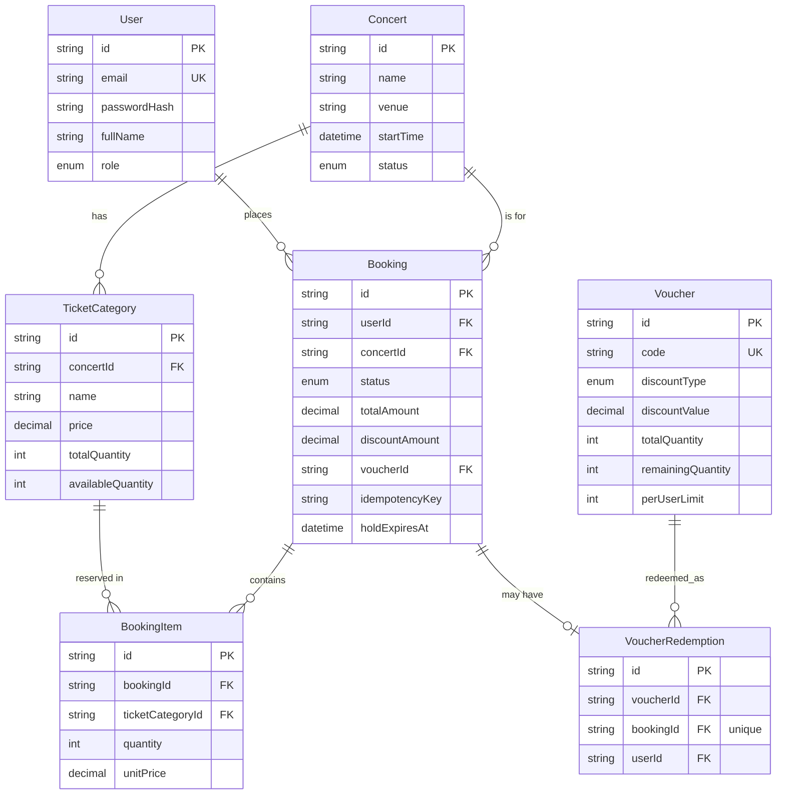

# System & Database Design

## 1. Overview

Two client surfaces are served by one NestJS monolith:

- **Customer-facing booking flow**: browse concerts, view ticket categories/prices, reserve
  tickets, apply a voucher, track booking status.
- **Internal Operation Dashboard**: publish concerts, manage ticket categories, monitor/filter
  bookings, manually override a booking's status, create voucher campaigns.

A monolith (rather than separate services) was chosen deliberately: the two surfaces share the
same data model and transactional boundaries (a booking touches ticket inventory, voucher
inventory, and the order itself atomically), and splitting them into services for a 1-2 day
scoped assignment would add deployment/coordination overhead without a corresponding benefit.
Module boundaries inside the app (`auth`, `concerts`, `vouchers`, `bookings`) mirror where a
future service split would happen, if traffic ever justified it.

```
┌────────────────────┐        ┌────────────────────┐
│   Customer client   │        │  Operator dashboard │
└──────────┬──────────┘        └──────────┬──────────┘
           │ HTTPS (JWT)                   │ HTTPS (JWT, OPERATOR role)
           ▼                               ▼
┌─────────────────────────────────────────────────────┐
│                     NestJS API                       │
│  auth · concerts · vouchers · bookings modules        │
│  Global: JwtAuthGuard, RolesGuard, ThrottlerGuard      │
└───────────┬───────────────────────────┬──────────────┘
            │                           │
            ▼                           ▼
   ┌─────────────────┐         ┌─────────────────┐
   │   PostgreSQL     │         │      Redis       │
   │ source of truth: │         │ cache-aside for   │
   │ inventory, orders│         │ concert browsing; │
   │ (via Prisma)     │         │ throttler storage │
   └─────────────────┘         └─────────────────┘
```

## 2. Data model

See [`prisma/schema.prisma`](../prisma/schema.prisma) for the full, authoritative definition.
Summary:



Two unique constraints do most of the correctness work in this design and are called out
explicitly because they're easy to miss on a casual read of the schema:

- `Booking.(userId, idempotencyKey)` is unique.
- `VoucherRedemption.(voucherId, userId)` is unique, and `VoucherRedemption.bookingId` is unique.

## 3. Booking state machine

```
PENDING_PAYMENT ──pay──▶ CONFIRMED
       │
       ├──cancel (customer)────▶ CANCELLED
       ├──hold expires (cron)──▶ EXPIRED
       └──admin override───────▶ FAILED / CANCELLED / EXPIRED / CONFIRMED
```

A booking is created as `PENDING_PAYMENT` with a `holdExpiresAt` timestamp
(`BOOKING_HOLD_MINUTES`, default 10 minutes). `POST /bookings/:id/pay` simulates a payment
provider callback and moves it to `CONFIRMED` (no real payment gateway is integrated — see
`docs/ASSUMPTIONS.md`). Whenever a booking leaves `PENDING_PAYMENT` for `CANCELLED`, `EXPIRED`,
or `FAILED`, its reserved ticket inventory and any voucher redemption are released back — see
`BookingsService.releaseBooking()`, which is the single code path shared by customer cancel,
the expiry sweep, and the admin manual override.

## 4. Concurrency control — the actual design problem

The assignment's stated concern is a flash sale: ~50,000 users, 300-500 booking requests/minute,
against limited ticket/voucher inventory. Three failure modes were called out explicitly:
**overselling**, **duplicate bookings from client retries**, and **voucher abuse**. All three are
solved at the **database transaction level**, not with an external lock service — at the stated
traffic (300-500 writes/min ≈ 5-8/s), Postgres row-level locking is more than sufficient, and
avoids the operational complexity and failure modes (lock expiry vs. process death, split-brain)
of a separate distributed-lock system.

### 4.1 Oversell prevention

Naively, "check available quantity, then decrement" is a read-then-write race: two concurrent
requests can both read `availableQuantity = 1`, both decide there's stock, and both decrement —
resulting in `-1`, an oversold ticket. The fix used here (`BookingsService.create`) collapses the
check and the write into **one atomic conditional UPDATE**:

```sql
UPDATE ticket_categories
SET available_quantity = available_quantity - :qty
WHERE id = :id AND available_quantity >= :qty
```

Postgres takes a row lock for the duration of this statement, so concurrent transactions
targeting the same row serialize on it. Whichever transaction's `UPDATE` runs first sees the
row's committed state and decrements; if the resulting row count is `0`, no row satisfied
`available_quantity >= :qty`, and the service raises `ConflictException` — no read-then-write gap
exists because the check is a `WHERE` clause on the same statement as the write. The same pattern
is used for `Voucher.remainingQuantity` in `VouchersService.redeem`.

This is executed inside the same Prisma interactive transaction (`$transaction`) that also
creates the `Booking` and `BookingItem` rows, so a failure partway through (e.g. category B is
out of stock after category A was already decremented for a multi-item booking) rolls back
everything, including the earlier decrement.

### 4.2 Duplicate bookings from client retries

Flash-sale traffic means client-side retries (timeouts, double-clicks, mobile network hiccups)
are expected. `POST /bookings` requires an `Idempotency-Key` header. `Booking` has a unique
constraint on `(userId, idempotencyKey)`. The service first does a fast-path lookup for an
existing booking with that key; if two retries race past that check simultaneously, the second
`INSERT` hits the unique constraint and throws `P2002`, which aborts and rolls back that
transaction (releasing any inventory it had provisionally decremented). The caller then re-reads
by the idempotency key and returns the *original* booking — so a retried request is guaranteed to
either see the first attempt's result or a clean error, never a second reservation.

### 4.3 Voucher abuse prevention

Two constraints combine: the atomic conditional decrement on `remainingQuantity` (§4.1's pattern,
reused) prevents redeeming more vouchers than exist in total, and a unique constraint on
`VoucherRedemption.(voucherId, userId)` prevents any single user from redeeming the same voucher
more than `perUserLimit` (currently hard-coded to the DB-enforceable case of 1 — see
`docs/ASSUMPTIONS.md`) times, again with no race window because the constraint is enforced by the
database at `INSERT` time inside the same transaction as the ticket reservation.

### 4.4 Handling read load (the actual high-QPS part)

50,000 users *browsing* concerts generates far more read traffic than the 300-500/minute booking
writes. `GET /concerts` and `GET /concerts/:id` are cached in Redis (cache-aside, ~20s TTL,
invalidated on admin publish/update) so this load never has to reach Postgres per-request. This
is a performance optimization, not a correctness mechanism — the source of truth is always
Postgres.

### 4.5 What Redis is — and isn't — used for

- **Cache-aside** for concert browsing (§4.4).
- **Rate limiting**: `POST /bookings` (and all routes, via a global `ThrottlerGuard`) is
  rate-limited per client using Redis-backed storage, to blunt retry storms during the flash
  sale.
- **Not used** for the oversell/duplicate/voucher-abuse guarantees themselves — those are
  Postgres transaction guarantees (§4.1-4.3). This is a conscious trade-off: a Redis-based
  distributed lock or a virtual waiting room would matter at far higher write throughput than
  300-500/min, but would add a second source of truth to keep consistent with Postgres for no
  correctness benefit at this scale. Documented as a "next step for extreme scale" in
  `docs/ASSUMPTIONS.md`.

## 5. Expiry sweep

A `@Cron(EVERY_30_SECONDS)` job (`BookingsService.expireStaleHolds`) finds `PENDING_PAYMENT`
bookings past their `holdExpiresAt` and releases them the same way a customer cancellation does,
so tickets/vouchers abandoned mid-checkout become available again quickly during a flash sale
rather than staying reserved for the full hold window's worst case.

## 6. Auth

JWT-based (Passport), two roles: `CUSTOMER` and `OPERATOR`. Public self-registration always
creates a `CUSTOMER`; the seeded `OPERATOR` account is how the dashboard is accessed in this
exercise (see `docs/ASSUMPTIONS.md` for why there's no operator invite flow). A global
`JwtAuthGuard` requires authentication by default; routes are opted out with `@Public()`
(concert browsing, auth endpoints). A global `RolesGuard` enforces `@Roles(Role.OPERATOR)` on all
`/admin/*` controllers.
